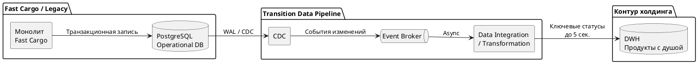

# План архитектурной трансформации Fast Cargo

## 1. Выгоды бизнеса
- **Поддержка роста бизнеса ×10** после интеграции с холдингом "Продукты с душой": до 500 тысяч отправлений в сутки и 200 RPS на создание заказов. 
- **Снижение риска простоя:** устранение общей PostgreSQL как единой точки отказа и изоляция высоконагруженных потоков IoT, EDI и аналитики. Сейчас тяжёлые отчёты блокируют регистрацию заказов и запись координат.
- **Интеграция с системами холдинга:** EDI, телематика/IoT, CRM и DWH.
- **Соответствие ФЗ-152 и PCI DSS:** изоляция персональных данных и платёжного контура, исключение PAN из систем Fast Cargo.
- **Ускорение изменений:** разделение монолита по доменам позволит отказаться от полного тестирования и деплоя всей системы при изменении одного модуля.

## 2. Базовая и целевая архитектура

### AS-IS
Текущая система — монолитный бэкенд с несколькими модулями, единым BFF, интеграционным шлюзом и одним физическим экземпляром PostgreSQL.

Главный антипаттерн: общая БД и высокая связанность модулей. Домены используют единое хранилище и синхронные вызовы, нагрузка одного модуля влияет на остальные. PostgreSQL является единой точкой отказа.

### TO-BE
Целевое состояние через год — событийно-ориентированная микросервисная архитектура с изолированными доменами и изолированными хранилищами для них.

Ключевые принципы:
- асинхронный обмен событиями между доменами
- изолированные хранилища вместо общей PostgreSQL (паттерн Database per Service)
- согласованность данных для распределённых бизнес-процессов (eventual consistency)
- изоляция потоков IoT от склада и биллинга
- изолированный платёжный модуль
- изоляция персональных данных от операционной логики

Целевая архитектура должна исключать временные адаптеры и транзитные механизмы, сохраняя только стабильные системные границы и постоянные интеграционные контракты.

## 3. Область применения

| In-Scope | Out-of-Scope |
| --- | --- |
| Монолит Fast Cargo | Внутренняя архитектура EDI холдинга |
| PostgreSQL и разделение данных по доменам | Внутренняя архитектура DWH холдинга |
| Интеграционный шлюз / BFF | Внутренняя архитектура CRM холдинга |
| Интеграция с EDI, DWH, CRM | Системы банка-эквайера |
| Потоки телематики / IoT | Внутренние системы торговых сетей |
| Платёжная интеграция | Физическая логистика и автопарк |
| Контур персональных данных | Бухгалтерия и юридические процессы |

## 4. Ограничения и допущения

| Категория | Ограничение |
| --- | --- |
| Срок | Полная трансформация — 1 год, аналитический контур DWH — 3 месяца |
| Legacy | Первые 3 месяца не изменять исходный код монолита |
| БД | Не создавать дополнительную нагрузку на PostgreSQL |
| Аналитика | Задержка доставки ключевых статусов в DWH не более 5 секунд |
| ИБ | Соблюдение ФЗ-152, передача данных во внешний аналитический контур только в обезличенном виде |
| PCI DSS | PAN не должны попадать в контур Fast Cargo |
| Бюджет | Конкретный бюджет не задан, решение должно пройти оценку производственно-инфраструктурного департамента и операционного блока по стоимости эксплуатации и ROI. |

## 5. Transition Architecture

Тактический план на 3 месяца:
| Уровень архитектуры | Текущее состояние (AS-IS) | Переходное состояние (через 3 месяца) | Обнаруженный GAP и локация изменений |
| --- | --- | --- | --- |
| Данные (Data) | Операционные данные находятся в единой PostgreSQL, тяжёлое чтение блокирует транзакционные операции | Изменения читаются из WAL через CDC и асинхронно передаются в DWH. | Нет независимого потока аналитических данных.  Data: CDC + брокер сообщений. |
| Приложения (Apps) | Монолит и BFF синхронно работают с общей БД. | Монолит не изменяется. Добавляется независимый CDC/Data Integration Pipeline для DWH | Нет интеграционного механизма для аналитики без изменения legacy.  Интеграционный слой: CDC pipeline. |
| Инфраструктура (Infra) | PostgreSQL одновременно обслуживает транзакционную и отчётную нагрузку. | CDC, брокер и коннектор DWH развёрнуты отдельно от монолита.Настроен мониторинг. | Нет выделенной инфраструктуры доставки событий.  Infra: брокер, CDC, мониторинг, сетевые доступы. |

## 6. Описание переходного состояния

Для первого этапа применяется паттерн CDC (Change Data Capture) + потоковая передача событий (Event Streaming).

CDC читает изменения непосредственно из WAL-логов, поэтому не выполняет аналитические запросы к операционным таблицам и не требует изменения исходного кода монолита.

Такой переходный контур:
- не требует изменения legacy
- не создаёт дополнительной нагрузки запросами для получения данных
- отделяет аналитическую нагрузку от транзакционной
- обеспечивает асинхронную доставку данных
- позволяет независимо масштабировать пайплайн

## 7. Дорожная карта, риски и план перехода

### Пакеты работ и сроки

Месяц 1 — инфраструктура и CDC:
- ИТ Fast Cargo: настройка CDC для PostgreSQL WAL без изменения монолита
- Инфраструктурная команда: брокер сообщений, сетевые доступы, мониторинг и тестовый контур

Месяц 2 — интеграция с DWH:
- Настройка трансформации и доставки событий в DWH
- Нагрузочное тестирование и контроль end-to-end задержки

Месяц 3 — параллельная эксплуатация и переключение:
- Сверка данных операционной БД и DWH
- Включение потока и мониторинг SLA

### Управление рисками и откат

| Риск | Действие |
| --- | --- |
| CDC увеличивает нагрузку на PostgreSQL | Нагрузочное тестирование и мониторинг |
| Отставание пайплайна более 5 секунд | Масштабирование брокера |
| Потеря событий | Защита брокера от потерь и подтверждение обработки сообщений |
| Некорректные данные в DWH | Синхронизация между PostgreSQL и DWH |
| Сбой нового контура | Остановить CDC-потребителей и поток в DWH, операционный монолит продолжает работать без изменений |

Откат должен запускаться только по объективным согласованным метрикам мониторинга. Инфраструктурные изменения рекомендуется фиксировать через IaC для воспроизводимого возврата к стабильной конфигурации.

### Критерии успешности и переключение

Переходное решение считается готовым если:
- Задержка доставки аналитических данных менее 5 секунд
- монолит работает без изменения исходного кода
- CDC не выполняет дополнительные аналитические запросы
- данные DWH проходят синхронизацию с операционной PostgreSQL
- персональные данные передаются во внешний аналитический контур только в обезличенном виде
- сбой аналитического пайплана не нарушает создание заказов, складские операции и доставку
