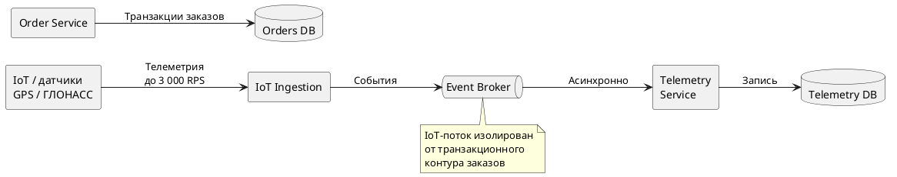

## Отработка возможных возражений

### Возражение 1. Техлид Fast Cargo

> Временное решение для DWH создаст риски для стабильности текущих отгрузок и потребует переписывания легаси-кода.

**Ответ:** изменение legacy-кода не требуется. В переходном состоянии используется CDC: изменения асинхронно считываются из БД и передаются в отдельный аналитический контур. Монолит и его бизнес-логика остаются неизменными, а аналитика не создаёт дополнительные запросы к транзакционным таблицам.

### Возражение 2. Департамент ИБ «Продуктов с душой»

> Интеграция CRM нарушает требования ФЗ-152, так как персональные данные лежат в общем контуре монолита.

**Ответ:** в целевой архитектуре персональные данные выводятся из общего операционного контура в физически изолированный сервис профилей с собственной БД. CRM не получает прямого доступа к транзакционной БД Fast Cargo и взаимодействует через контролируемый интеграционный интерфейс. Данные, передаваемые во внешний аналитический контур - обезличиваются.

### Возражение 3. Производственно-инфраструктурный департамент

> Поток телематики IoT на 3 000 RPS создаст цунами данных и мгновенно уронит текущую инфраструктуру и СУБД.

**Ответ:** поток IoT не должен направляться синхронно в общую PostgreSQL. В целевой архитектуре телеметрия выделяется в отдельный событийный контур: приём данных > брокер событий > независимые потребители и хранилище телеметрии. Это отделяет высоконагруженную запись координат от заказов, склада и биллинга.

